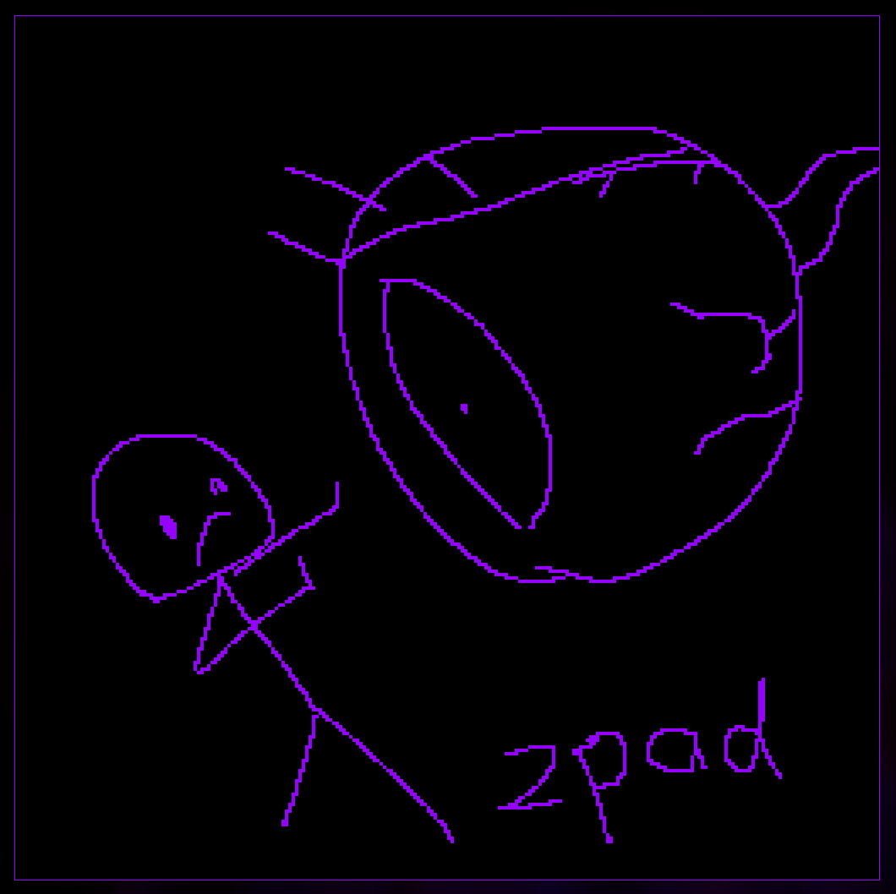

# zpad

Scratchpad for Linux desktops. Intended to be opened via shortcut and closed soon after.
Nothing is persistent.
The canvas is infinite and monochrome.

## Installation

The easiest way is by using Cargo, which can be installed using [rustup](https://rustup.rs/).

Run `cargo install --git https://github.com/mestiez/zpad`

## Dependencies

- raylib

## Building

Run `cargo build -r` in the project folder.
The output binary will be at `target/release/zpad`. You can move it to your
local binary path.

## Usage

|      Input | Action           |
|-----------:|:-----------------|
|      `LMB` | Draw             |
|      `RMB` | Erase            |
|      `MMB` | Pan              |
|        `G` | Grid mode (hold) |
| `Q`, `Esc` | Quit             |

## Known issues and limitations

Most of these stem from the fact that this program was made entirely for my personal use.

- There is no limit to the size of the canvas. It is expanded as necessary,
  and going too far might cause you to run out of memory.
- There has been no consideration for input methods other than a mouse
- You can't zoom in and out
- Aspects that might normally be configurable (colour, scale, window position and size) are hardcoded
- All drawings are permanently discarded once the program exits
- You can only draw in one colour
- If your window manager doesn't support alt resizing, it's probably impossible to resize the window

## Future

These are things I would like to implement but probably won't, unless I discover that I really REALLY need them at some
point.

- Brush size
- Colours / dithered shading
- Zoom
- Save/load
- Copy/paste
- Undo/redo